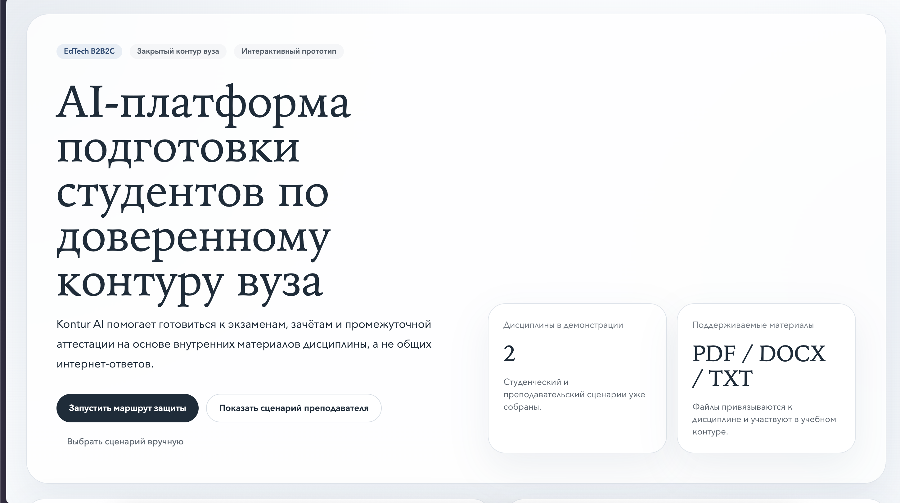
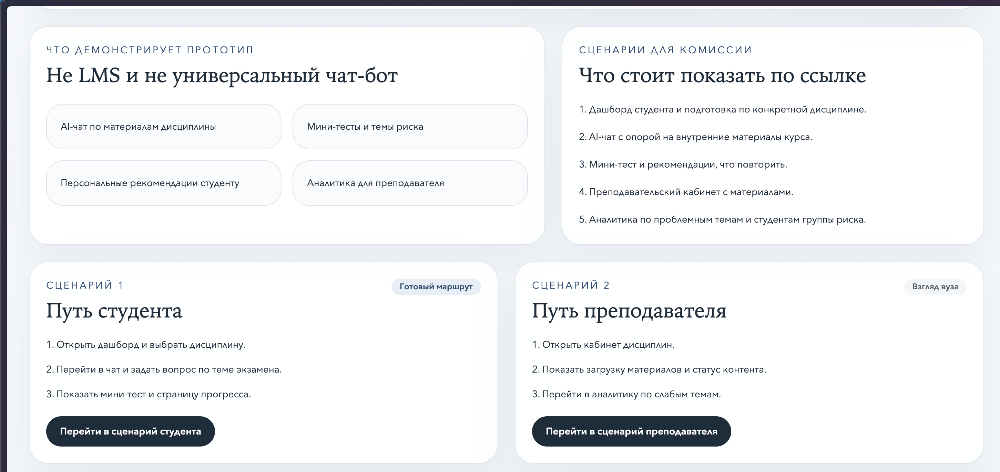
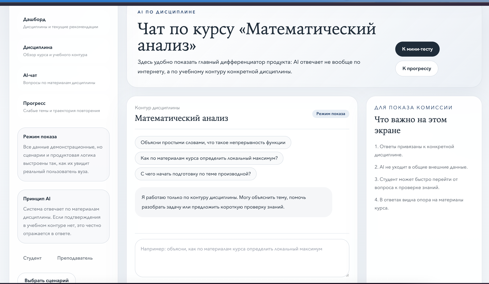
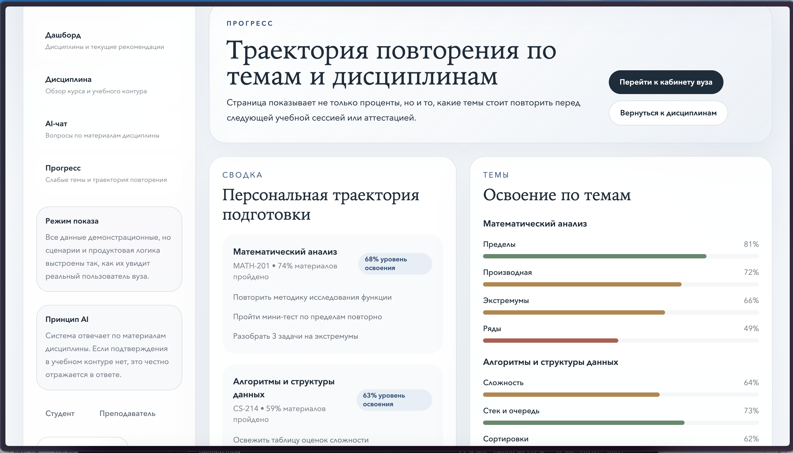
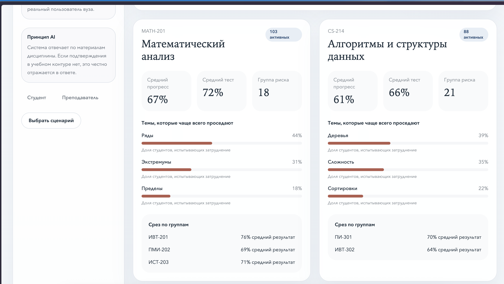

# Kontur AI

**Платформа подготовки студентов по доверенному контуру вуза.** Подготовка к экзаменам идёт по внутренним материалам конкретной дисциплины, а вуз получает аналитику по слабым темам в течение семестра, а не по итогам сессии.

### 👉 [Открыть живой прототип](https://prosttessts.netlify.app)

Сквозные сценарии для двух ролей, две учебные дисциплины, работает без регистрации.

---

## Проблема

Студент готовится по случайным источникам: конспекты однокурсников, ответы из поиска, видео неизвестного качества. Материалы преподавателя при этом лежат в почте, чатах и на диске — и в подготовке почти не участвуют.

Вуз не видит картину до самой сессии. Какие темы проваливаются у потока, кто в группе риска, где курс стоит переработать — всё это становится известно, когда менять уже поздно.

## Чем это не является

Осознанно не LMS и не универсальный чат-бот. LMS решает администрирование учебного процесса. Универсальный бот отвечает по всему интернету и потому не годится для подготовки к аттестации. Здесь узкая задача: подготовка по проверенному материалу курса с обратной связью для вуза.

---

## Как это работает

### AI отвечает только по материалам курса

Главный дифференциатор продукта. Модель не уходит в общие внешние данные: если подтверждения в учебном контуре нет, это честно отражается в ответе. Именно это делает подготовку пригодной для аттестации — студент не рискует выучить чужую трактовку.

### Студент видит траекторию, а не просто проценты

Освоение разбито по темам, слабые места подсвечены, и к ним прилагаются конкретные действия: что повторить, какой мини-тест пройти заново, сколько задач разобрать. Проценты без следующего шага бесполезны.

### Вуз видит проблемные темы и группу риска

Средний прогресс по дисциплине, доля студентов, испытывающих затруднение по каждой теме, срез по учебным группам и количество студентов в группе риска. Это тот слой, ради которого вуз принимает решение о внедрении.

---

## Демо-маршрут — 3 минуты

| Шаг | Что смотреть |
|---|---|
| 1 | Дашборд студента — подготовка привязана к дисциплине |
| 2 | AI-чат — ответ по внутренним материалам курса |
| 3 | Мини-тест и рекомендации, что повторить |
| 4 | Кабинет преподавателя — материалы и их статус |
| 5 | Аналитика — слабые темы потока и группа риска |

В демо две дисциплины: `MATH-201` Математический анализ и `CS-214` Алгоритмы и структуры данных. Материалы принимаются в PDF, DOCX и TXT.

---

## Продуктовые решения

**Два раздельных сценария вместо одного универсального интерфейса.** У студента и вуза разные задачи и разные метрики успеха: студенту нужна подготовка, вузу — управляемость. Общий интерфейс размывал бы обе.

**Материалы привязаны к дисциплине, а не к пользователю.** Это ядро ценности: ответ модели ограничен проверенным контуром курса, поэтому ему можно доверять при подготовке к аттестации. Без этого ограничения продукт превращается в очередной чат-бот.

**Аналитика для преподавателя как аргумент для внедрения.** Студент — пользователь, но решение о запуске принимает вуз. Без измеримой ценности для второй стороны продукт не проходит согласование, каким бы удобным он ни был.

**Мини-тесты вместо самооценки.** Спрашивать студента, что он знает плохо, бесполезно — слабые темы выявляются диагностикой, а не опросом.

**Честный ответ вместо правдоподобного.** Если в материалах курса подтверждения нет, система говорит об этом прямо. В подготовке к аттестации уверенная выдумка опаснее отказа.

---

## Статус и что показал пилот

Рабочий прототип со сквозными сценариями для обеих ролей.

Пилот в учебной группе выявил главное ограничение: инфраструктура вуза к внедрению не готова. По итогам зафиксированы требования к среде развёртывания и переработан план внедрения — сейчас идёт согласование запуска на кампусе для группы разработчиков.

Вывод, который забрал из этого: для B2B2C-продукта в образовании готовность организации критичнее качества самого продукта. Прототип работал — не хватало не функций, а условий на стороне заказчика.

## Моя роль

<!-- ОТРЕДАКТИРУЙ под реальное распределение работы в команде -->

Продуктовая часть: постановка проблемы и целевой аудитории, объём MVP, роли пользователей, 2 - 3 варианта пользовательских сценариев, требования и ТЗ совместно с разработкой, подготовка защиты проекта и переговоры по внедрению.

---

**Контакты:** [@Shindaro](https://t.me/Shindaro)
